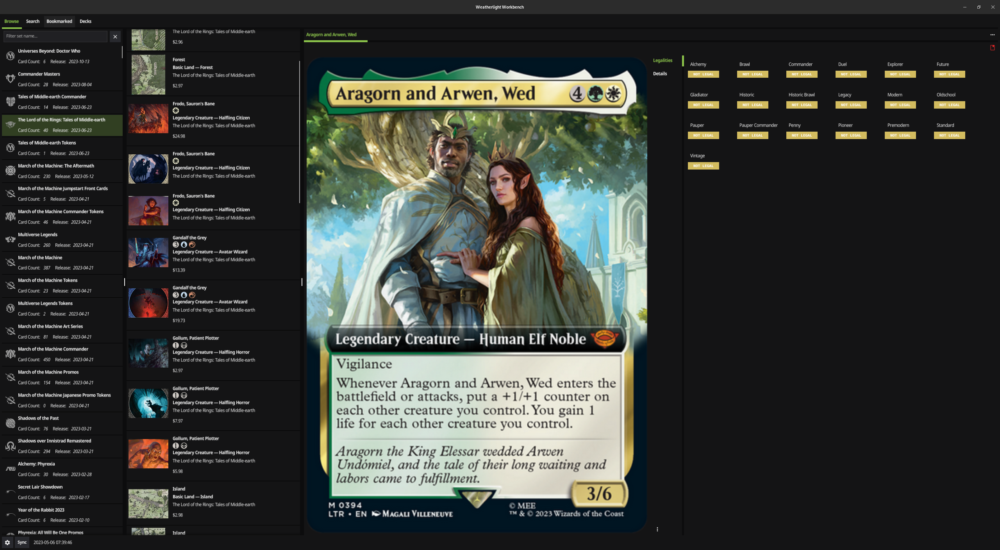

# Weatherlight Workbench

Start browsing, searching, and bookmarking your favorite Magic The Gathering cards. This project is not affiliated with Wizard's of the Coast. We're just fans of the game and wanted to have a quick way to lookup and store our favorite cards, all on our local machine.

## Packaging

Fyne apps can be packaged for many different platforms.

### Android

- Install android sdk/ndk
- Set ANDROID_NDK_HOME
- cd {PROJECT_ROOT}/cmd/weatherlightworkbench
- fyne package -os android -appID io.highcreeksoftware.weatherlightworkbench --icon ../../internal/platform/icons/app_icon.png
- adb install weatherlightworkbench.apk